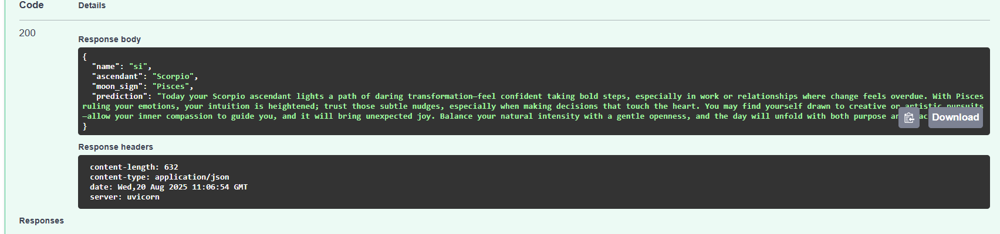

# Astro Prediction API

A FastAPI-based microservice that generates astrological predictions using birth details and city of birth.

---

## Features
- Accepts user details: name, birth date, birth time, and city.
- Converts the city name to latitude/longitude internally for astrological calculations.
- Returns ascendant, moon sign, and a personalized prediction.
- Interactive Swagger UI at `/docs`.

---

## 📦 Installation

1. Download the zip file, Extract and locate in the system

#### Create a virtual environment (optional but recommended):

python -m venv venv
source venv/bin/activate   # On Linux/Mac
venv\Scripts\activate      # On Windows

#### Install dependencies:

pip install -r requirements.txt

#### Running the App

Start the FastAPI server with: 
uvicorn app:app --reload

The API will be available at: http://127.0.0.1:8000/docs

Example Input: 

{"name": "MyNaksh",
   "birth_date": "2001-03-23",
   "birth_time": "21:04",
   "city_name":"delhi"}

Example Output:
	
{
  "name": "MyNaksh",
  "ascendant": "Scorpio",
  "moon_sign": "Pisces",
  "prediction": "Today your Scorpio ascendant lights a path of daring transformation—feel confident taking bold steps, especially in work or relationships where change feels overdue. With Pisces ruling your emotions, your intuition is heightened; trust those subtle nudges, especially when making decisions that touch the heart. You may find yourself drawn to creative or artistic pursuits—allow your inner compassion to guide you, and it will bring unexpected joy. Balance your natural intensity with a gentle openness, and the day will unfold with both purpose and peace."
}
